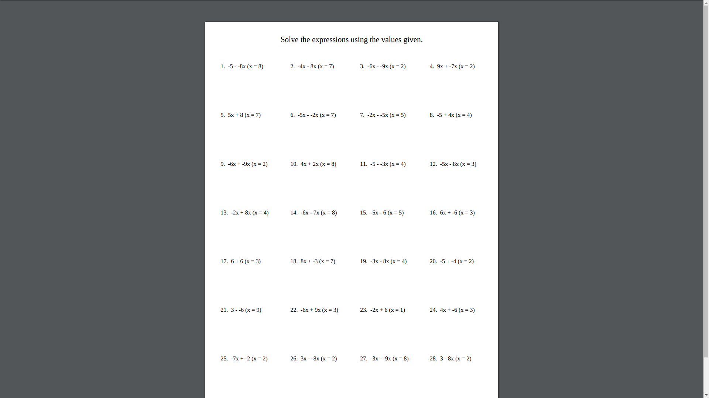

# mathp
Math problem generation.
## Install
Prerequisites:
* Golang (https://golang.org)
```
git clone https://github.com/vikramdurai/mathp
cd mathp
go install
```
## API Calls and Parameters
- **/api/**:
    the API endpoint. Uses the following parameters:

    | Parameter |    Sample Values        |    Type     |
    |-----------|-------------------------|-------------|
    | Grade     |    `5`,`3`,`6`          |    `int`    |
    | Syllabus  |   `NCERT`,`CBSE`        |   `string`  |
    | Mode      |`Algebra`,`Geometry`     |   `string`  |
    | Pattern   | `polynomial`,`lineq`    |   `string`  |
    | Amount    |   `3`,`4`,`7`,`9`       |   `int`     |

    Currently we only use Pattern and Amount, so feel free to omit the others in the url
    for the time being.

    Usage:
    ```
    GET /api/?pattern=<pattern>&amount=<amount>
    ```
    For example:
    ```
    GET /api/?pattern=polynomial&amount=2
    ```
    returns a JSON-encoded reply containing two polynomials.
    
    A typical result:
    ```
    {
        "request": {
            "pattern": "polynomial",
            "amount": 2,
        },
        "reply": [
            "3x + -4y",
            "4a² - 2bc²a",
        ]
    }
    ```
- **/api/pdf**:
    the API endpoint that generates PDFs. No parameters, delivers raw `application/pdf`.
    I may add some customization options later. Output of this endpoint looks something
    like this:
    
